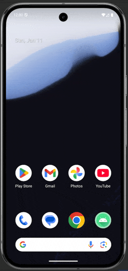
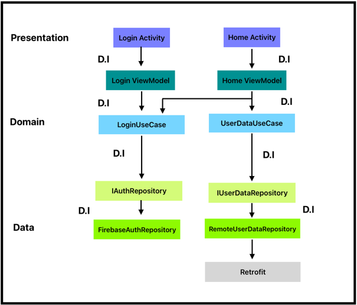

# BasicApp
A sample Android app demonstrating Clean MVVM architecture with Hilt, Firebase Auth, and remote API integration.
Implements user authentication and user data fetching with Firebase and a remote API.

## Features
- User authentication with Firebase
- Fetch and display user data from a remote API
- Clean MVVM architecture (Presentation, Domain, Data layers)
- Dependency injection with Hilt
- ViewBinding for UI
- Coroutines for asynchronous operations

## Project Structure

- `data/`: Data layer with repositories and remote data sources
- `domain/`: Domain layer with models and use cases
- `presentation/`: Presentation layer with activities, viewmodel, and adapters
- `di/`: Hilt dependency injection modules

## Testing
- Added user - "gaurav@gmail.com" with password - "password" for testing authentication.

## Getting Started

1. **Clone the repository**
2. **Open in Android Studio**
3. **Configure Firebase** -> Add your `google-services.json` to `app/`
4. **Build and run the app**

## Tech Stack

- Kotlin
- MVVM (Clean Architecture)
- Hilt (DI)
- Firebase Auth
- Retrofit
- Coroutine
- ViewBinding
